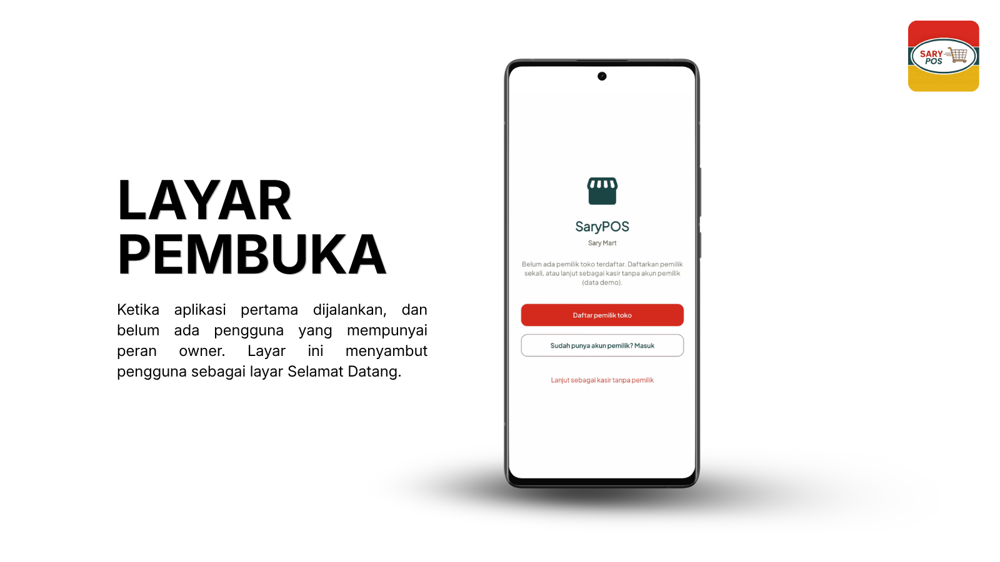
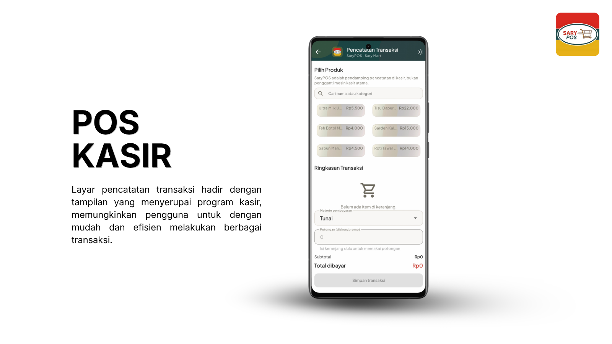
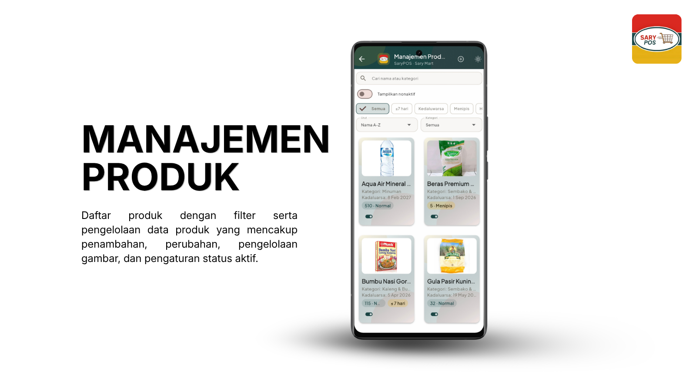
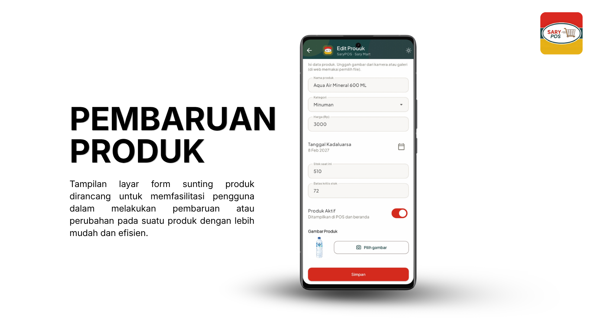
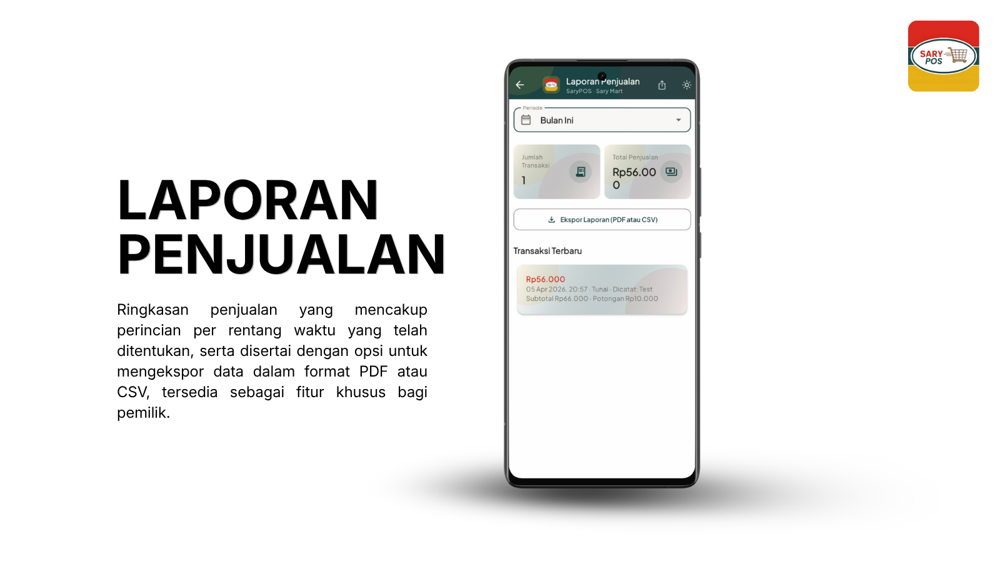
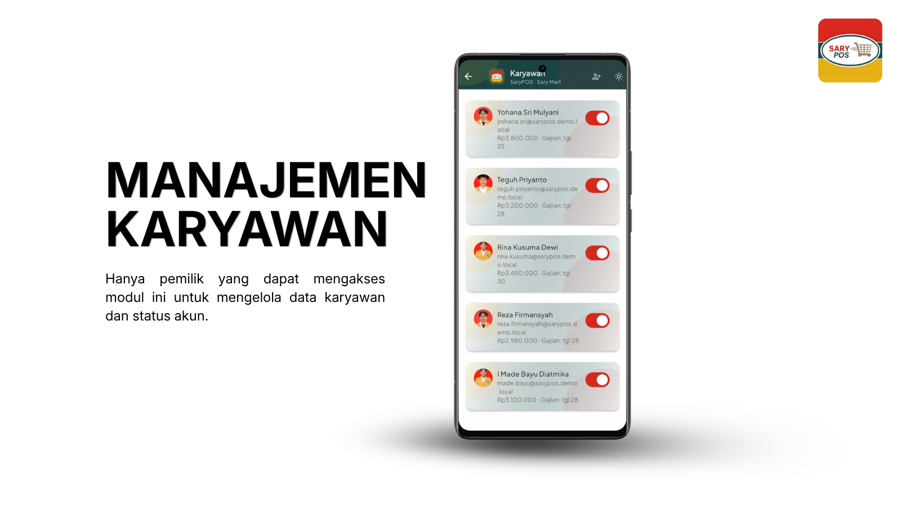
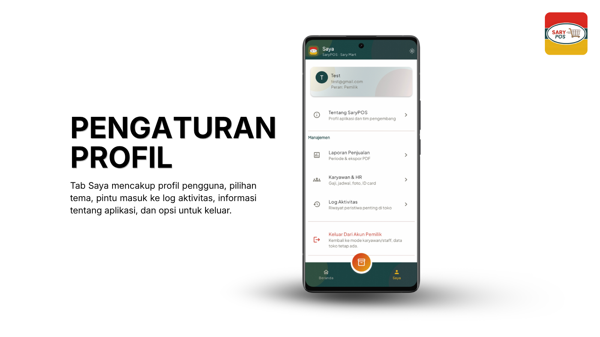
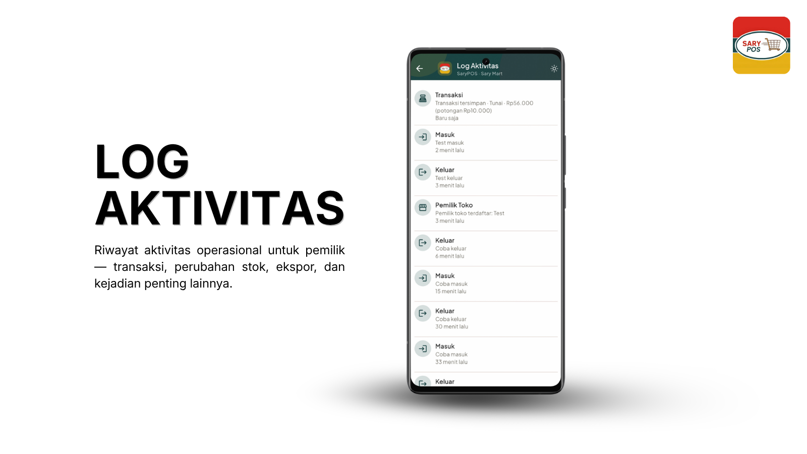

<a name="top"></a>

<div align="center">


</div>

<p align="center">
  
  
  
  
</p>

<h1 align="center">SaryPOS</h1>

<p align="center">
  <i>Aplikasi POS dan manajemen inventori pendamping untuk Sary Mart, Proyek Akhir Pemrograman Aplikasi Bergerak (PAB)</i>
</p>

---

## Daftar isi

- [Daftar isi](#daftar-isi)
- [Deskripsi aplikasi](#deskripsi-aplikasi)
- [Profil mitra: Sary Mart](#profil-mitra-sary-mart)
- [Profil kelompok: Radar Pramuka](#profil-kelompok-radar-pramuka)
- [Tampilan aplikasi (screenshot)](#tampilan-aplikasi-screenshot)
  - [1. Autentikasi \& layar pembuka](#1-autentikasi--layar-pembuka)
  - [2. Beranda (dashboard)](#2-beranda-dashboard)
  - [3. Kasir \& POS](#3-kasir--pos)
  - [4. Produk](#4-produk)
  - [5. Stok](#5-stok)
  - [6. Laporan penjualan](#6-laporan-penjualan)
  - [7. Karyawan](#7-karyawan)
  - [8. Pengaturan \& profil](#8-pengaturan--profil)
  - [9. Log aktivitas](#9-log-aktivitas)
- [Fitur utama](#fitur-utama)
- [Widget dan komponen](#widget-dan-komponen)
- [Paket (dependencies)](#paket-dependencies)
- [Struktur proyek](#struktur-proyek)
- [Menjalankan dari source code](#menjalankan-dari-source-code)
  - [Langkah ringkas](#langkah-ringkas)
- [Instalasi APK](#instalasi-apk)
- [Materi kurikulum](#materi-kurikulum)

---

## Deskripsi aplikasi

<p align="justify"><strong>SaryPOS</strong> adalah aplikasi seluler berbasis <strong>Flutter</strong> untuk membantu pemilik dan karyawan <strong>Sary Mart</strong> mencatat penjualan, mengelola produk dan stok, memantau ringkasan kinerja, serta mengurus data karyawan. Data disimpan di <strong>Supabase</strong> (PostgreSQL dan autentikasi), dengan hak akses yang berbeda untuk peran <strong>owner</strong> dan <strong>karyawan atau kasir</strong>.</p>

<p align="justify">Fokus antarmuka: <strong>kasir dapat bertransaksi dengan cepat</strong> dan <strong>pemilik tetap dapat melihat gambaran operasional</strong> tanpa layar yang berlebihan. Aplikasi diposisikan sebagai POS pendamping dan dashboard ringkas, bukan pengganti mesin kasir fisik.</p>

---

## Profil mitra: Sary Mart

<p align="justify"><strong>Sary Mart</strong> adalah mitra bisnis sekaligus latar belakang langsung pengembangan SaryPOS. Toko ini berupa minimarket modern di <strong>Jl. MT Haryono</strong> yang menjual sembako dan kebutuhan harian, konsepnya mirip minimarket bermerek pada umumnya. Ceritanya berawal dari usaha keluarga di bidang percetakan bernama <strong>Sari Fotokopi</strong> di kawasan Pramuka. Seiring waktu, percetakan ikut pindah ke lokasi yang lebih ramai, banyak mahasiswa dan orang kantor lewat di situ. Keluarga kemudian membuka <strong>Sary Mart</strong> sebagai langkah masuk ke bisnis ritel. Sasaran utamanya adalah pekerja kantoran di sekitar MT Haryono, karena ketika toko dibuka belum ada minimarket sejenis di kawasan tersebut. <strong>Operasional dimulai pada 15 Desember 2024.</strong></p>

<p align="justify">Menurut pemilik, berpindah dari percetakan ke ritel <strong>tidak sama dengan mulai dari nol</strong>. Pengalaman di <strong>sales dan pemasaran</strong> membantu ia memahami cara kerja pasar modern. Di awal sempat muncul ide bergabung dengan jaringan minimarket besar, tetapi akhirnya dipilih jalan <strong>beroperasi mandiri</strong>. Untuk stok barang, toko mengandalkan <strong>jaringan supplier</strong>, termasuk kelompok pemasok lintas Kalimantan, agar barang tetap bisa dijaga meski ada item yang sempat sulit dicari di pasaran.</p>

<p align="justify">Karena usahanya masih relatif baru, penjualan ikut naik turun mengikuti <strong>musim dan kalender</strong>. Awal tahun banyak hari libur. Saat Ramadan, pola belanja karyawan kantor berubah sehingga kategori seperti makanan siap saji, minuman, dan rokok yang biasa jadi andalan ikut terasa dampaknya. Pemilik saat ini masih <strong>ikut campur langsung</strong> di operasional harian. Ia berpendapat bisnis di fase awal sebaiknya tetap dekat dengan penanggung jawab utama supaya risiko kecolongan bisa ditekan, terutama jika tugas dan sistem dibiarkan sepenuhnya ke karyawan tanpa pengawasan yang cukup.</p>

<p align="justify"><em>Ringkasan ini bersumber dari wawancara dengan pemilik Sary Mart pada 3 Maret 2026.</em></p>

---

## Profil kelompok: Radar Pramuka

<div align="center">

| NIM | Nama | Kelas |
|:---:|:---:|:---:|
| 2409116087 | Mohamad Ariel Saputra D Loi | Sistem Informasi C 2024 |
| 2409116088 | Aris Candra Muzaffar | Sistem Informasi C 2024 |
| 2409116106 | Muhammad Arifin Alqi. Ab | Sistem Informasi C 2024 |
| 2409116107 | Dimas Aji Mukti | Sistem Informasi C 2024 |

</div>

---

## Tampilan aplikasi (screenshot)

### 1. Autentikasi & layar pembuka

<div align="center">



</div>

*Alur masuk ke aplikasi: login akun, atau layar pembuka saat belum ada owner terdaftar (pendaftaran pemilik pertama).*

### 2. Beranda (dashboard)

<div align="center">


</div>

*Ringkasan penjualan dan transaksi hari ini, kartu produk yang perlu perhatian, serta (untuk pemilik) cuplikan aktivitas terbaru.*

### 3. Kasir & POS

<div align="center">



</div>

*Layar pencatatan transaksi hadir dengan tampilan yang menyerupai program kasir, memungkinkan pengguna untuk dengan mudah dan efisien melakukan berbagai transaksi.*

### 4. Produk

<div align="center">



</div>

*Daftar produk dengan filter dan pengelolaan data produk (tambah, ubah, gambar, status aktif).*

### 5. Stok

<div align="center">



</div>

*Tampilan layar form sunting produk untuk melakukan pembaruan pada suatu produk.*

### 6. Laporan penjualan

<div align="center">



</div>

*Ringkasan penjualan per rentang waktu dan opsi ekspor PDF atau CSV (fitur pemilik).*

### 7. Karyawan

<div align="center">



</div>

*Hanya pemilik yang dapat mengakses modul ini untuk mengelola data karyawan dan status akun.*

### 8. Pengaturan & profil

<div align="center">



</div>

*Tab Saya mencakup profil pengguna, pilihan tema, pintu masuk ke log aktivitas, informasi tentang aplikasi, dan opsi untuk keluar.*

### 9. Log aktivitas

<div align="center">



</div>

*Riwayat aktivitas operasional untuk pemilik, meliputi transaksi, perubahan stok, ekspor, dan kejadian penting lainnya.*

---

## Fitur utama

<p>
  
  
  
  
</p>

| Fitur | Keterangan |
| ----- | ---------- |
| **Autentikasi & sesi** | Login, pendaftaran owner pertama, pengelolaan sesi |
| **Dashboard** | Ringkasan penjualan dan transaksi, pintu masuk ke modul utama |
| **POS / kasir** | Pilih produk, keranjang, simpan transaksi penjualan |
| **Produk & stok** | CRUD produk, perbarui stok, filter, indikator stok kritis |
| **Laporan** | Laporan penjualan per rentang waktu dan ekspor PDF atau CSV |
| **Karyawan** | Kelola data karyawan dengan pembatasan fitur untuk non-owner |
| **Log aktivitas** | Riwayat aktivitas operasional |
| **Pengaturan pengguna** | Tema, profil, dan pengaturan terkait akun |

<details>
<summary><b>Nilai tambah: paket di luar materi yang dipelajari saat praktikum</b></summary>

Selain packages yang menjadi materi wajib (misalnya <code>get</code>, <code>supabase_flutter</code>, <code>flutter_dotenv</code>), digunakan juga packages untuk ekspor PDF dan CSV, berbagi berkas/dokumen, pemilihan gambar atau dokumen, tipografi Google Fonts, kode batang, serta sugesti teks saat mengetik pada form. Daftar nama paket ada pada bagian <a href="#paket-dependencies">Paket (dependencies)</a>.

</details>

---

## Widget dan komponen

| Kategori | Widget / pola | Peran dalam aplikasi |
| -------- | --------------- | -------------------- |
| **Layout** | `Scaffold`, `SafeArea`, `SingleChildScrollView`, `ListView`, `GridView`, `PageView`, `Column`, `Row`, `Expanded`, `Flexible` | Kerangka halaman, daftar, dashboard |
| **Material** | `AppBar`, `Card`, `ListTile`, `Chip` / `FilterChip`, `FloatingActionButton`, `Divider` | Pola UI konsisten SaryPOS |
| **Input** | `TextField`, `TextFormField`, `DropdownButtonFormField`, `TypeAheadField` (<code>flutter_typeahead</code>) | Form login, produk, karyawan, pencarian |
| **Interaksi** | `InkWell`, `GestureDetector`, `IconButton`, `TextButton`, `ElevatedButton` | Tap, navigasi, konfirmasi |
| **Navigasi** | `Navigator`, rute GetX (<code>Get.to</code>, <code>Get.offAll</code>, dll.) | Alur setelah login antar fitur |
| **State & data** | GetX (<code>Obx</code>, controller), muat data async | UI reaktif dan integrasi Supabase |
| **Umpan balik** | `SnackBar`, dialog, komponen kustom: <code>AppBarSarypos</code>, <code>CardRingkasan</code>, <code>EmptyStateGenerik</code>, <code>SkeletonSarypos</code>, <code>SnackbarSarypos</code>, <code>BannerNotifikasiInApp</code> | Sukses, error, kosong, loading |

---

## Paket (dependencies)

| Paket | Fungsi |
| ----- | ------ |
| **get** | State management, injeksi dependensi, navigasi |
| **supabase_flutter** | Autentikasi, query, storage |
| **flutter_dotenv** | Membaca konfigurasi dari berkas lokal (bukan tertulis di kode sumber) |
| **intl** | Format angka, tanggal, mata uang |
| **pdf** & **printing** | Membuat dan menampilkan PDF |
| **share_plus** | Membagikan berkas hasil ekspor |
| **path_provider** | Path direktori untuk berkas sementara atau ekspor |
| **image_picker** | Gambar produk dari kamera atau galeri |
| **http** | Permintaan HTTP jika diperlukan |
| **barcode** | Data kode batang |
| **file_picker** | Memilih berkas di perangkat |
| **google_fonts** | Font |
| **csv** | Impor atau ekspor CSV |
| **shared_preferences** | Preferensi lokal (misalnya tema) |
| **flutter_typeahead** | Saran pada field teks |

**Pengembangan:** `flutter_lints`, `flutter_launcher_icons`, `flutter_test`.

---

## Struktur proyek

<details>
<summary><b>Struktur folder (ringkas)</b></summary>

```text
./
├── README.md
├── pubspec.yaml
├── .env.example
├── documentation/
├── release/               
├── assets/
│   └── images/
└── lib/
    ├── main.dart
    ├── config/             ← tema, konfigurasi Supabase
    ├── core/               ← utilitas, sesi, ekspor PDF/CSV, dll.
    ├── data/
    │   ├── models/
    │   └── sources/        ← akses Supabase
    ├── features/           ← auth, dashboard, produk, stok, pos, laporan, karyawan, pengaturan, log
    └── widgets/            ← komponen UI bersama
```

</details>

---

## Menjalankan dari source code

<details>
<summary><b>Prasyarat</b></summary>

- [Flutter SDK](https://docs.flutter.dev/get-started/install) yang kompatibel dengan batas `sdk` di `pubspec.yaml`.
- Proyek **Supabase** dengan skema dan kebijakan akses (RLS) yang selaras dengan aplikasi.
- Perintah `flutter` dan `dart` tersedia di terminal.

</details>

### Langkah ringkas

1. Buka terminal pada **root folder proyek** (folder yang berisi `pubspec.yaml`).

2. **Sambungkan ke Supabase (hanya di komputer pengembang)**  
   - Duplikat berkas `.env.example` dan simpan sebagai **`.env`** di folder yang sama.  
   - Isi **URL proyek** dan **anon key** dari dashboard Supabase (Settings → API).  
   Berkas `.env` hanya dipakai secara lokal. **Jangan** ikut mengunggahnya ke repositori publik (pastikan terdaftar di `.gitignore`).

3. Pasang dependensi:

   ```bash
   flutter pub get
   ```

4. Jalankan aplikasi:

   ```bash
   flutter run
   ```

   Untuk **web**, bila tidak memakai `.env`, Anda dapat menyalurkan nilai yang sama lewat `--dart-define=SUPABASE_URL=...` dan `--dart-define=SUPABASE_ANON_KEY=...`.

5. **Membangun APK release**

   ```bash
   flutter build apk --release
   ```

   Untuk build yang lebih dioptimalkan (obfuscate, simbol terpisah, tree-shake ikon):

   ```bash
   flutter build apk --release --split-per-abi --obfuscate --split-debug-info=build/app/debug-info --tree-shake-icons
   ```

   Output umum: `build/app/outputs/flutter-apk/`. Salin ke folder `release/` jika ingin dilampirkan pada repo atau rilis.

---

## Instalasi APK

**Di perangkat Android:**

1. Unduh berkas `.apk` yang sesuai dengan spesifikasi perangkat anda dari bagian releases di repo ini.
2. Buka berkas tersebut dan ikuti langkah pemasangan.
3. Bila diminta, izinkan pemasangan dari sumber yang dipercaya.

---

## Materi kurikulum

| Materi | Implementasi |
| ------ | ------------- |
| **Widget** | Layout, input, Material, dan widget kustom bersama |
| **State management** | GetX |
| **Navigasi** | Navigator dan pola GetX |
| **Supabase** | Autentikasi, data, pembatasan per peran |
| **Deployment** | Build APK (dan target lain sesuai kebutuhan) |

**Fitur minimum proyek:** login atau register sesuai alur aplikasi, CRUD pada data yang relevan, serta fitur tambahan yang mendukung mitra (POS, laporan, karyawan, dan sejenisnya).

---

<div align="center">


</div>

> [!NOTE]
> **SaryPOS**, Proyek Akhir PAB · Kelompok **Radar Pramuka** · **Sistem Informasi C 2024**

<p align="center">
  <a href="#top">Kembali ke atas</a>
</p>
